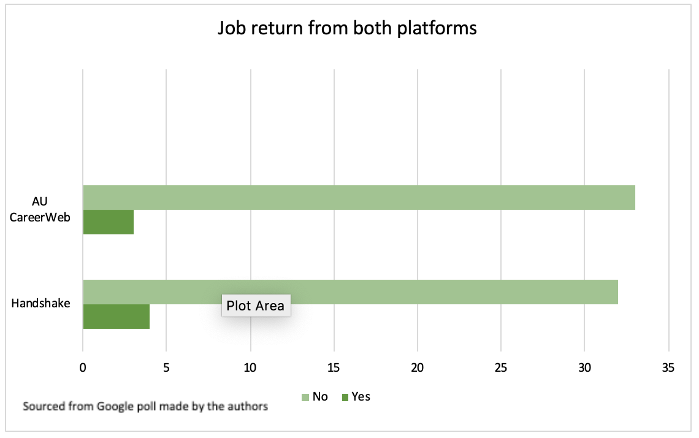
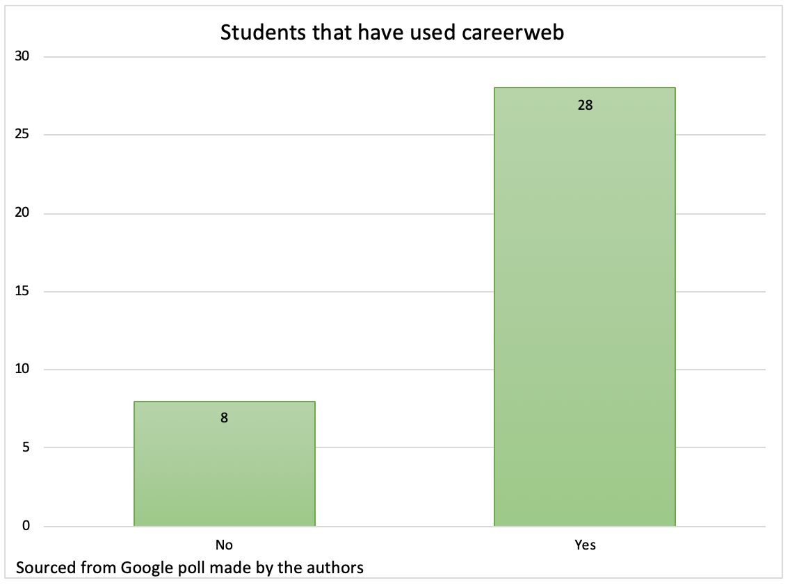
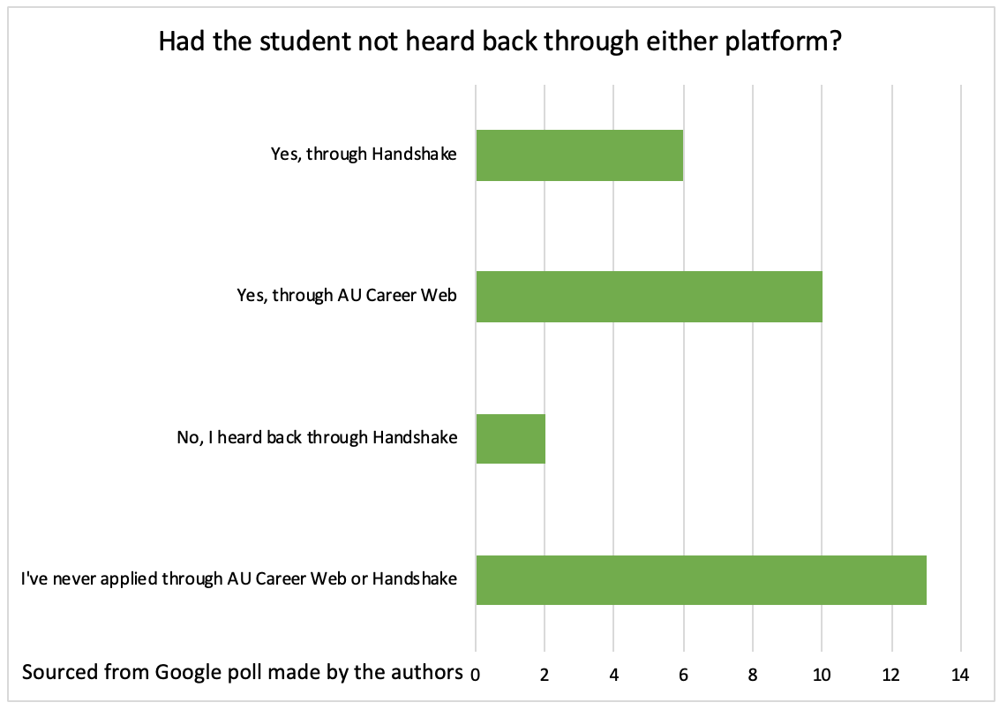

The American University Career Center switched career database platforms in the spring of 2018 from AU CareerWeb to the widely used platform Handshake after 14 years using the previous service. 

Since its initial launch, Handshake has partnered with over 700 universities and 300,000 recruiters seeking eager employees. 14 million college students and young alumni are currently registered on the platform. The American University Career Center announced the switch from its previous service to Handshake via a school-wide email on May 7, 2018 and it went into effect one week later on May 14.

Handshake was founded by three Michigan Tech students in September 2013 as a platform for students to have easy access finding jobs. The service was officially launched in June 2014 and by July 2017, 5 million applications had gone through the platform. With an emphasis on inclusion, Handshake has built up a diverse staff and now serves as the primary job search platform for eight of the top ten HBCUs. Handshake operates in a similar style to Linkedin as well as other job-finding sites like Idealist.com and American University’s former platform.

The American University Career Center partnered with Handshake with hopes of prioritizing students’ needs and making the job search experience simple. According to Nathan Slusher, the American University Career Center’s Director of Career Education and Outreach, “After 14 successful years of using the AU CareerWeb platform, the career services offices wanted to upgrade to a system that improved the student and employer user experience, expanded access to employers looking to recruit AU students and alumni, and included some additional features that help support students through every stage of the job search”.

Along with having an updated and easy to navigate interface, Handshake delivers custom and personalized recommendations based on aspects like a student’s major, location, and previous searches. Students have the ability to create professional profiles and make them viewable to employers who are actively recruiting. Two additional unique features include a reviews tab where students can hear feedback from others who worked at a company, as well as a Q&A discussion board where they can ask general career-related or job-specific questions and receive advice.

According to the Career Center, student engagement rates at American University are similar to those of peer institutions. American University currently has 8,200 approved employers and 17,355 active and expired job postings in its database. The switch to Handshake has widened the range of employers geographically with jobs available in the D.C. area and nationwide.

Dayana Sarova, a junior in the School of International Service, used AU CareerWeb during her freshman and sophomore year to upload her résumé and cover letter for career fairs on campus. The internships she was hired for at the National Security Archive and Council on Foreign Relations were found through connections and by directly applying through each company’s website.

“Handshake was helpful in terms of seeing what options are out there… and kind of just going from there. But in terms of getting a job, I don’t know if it does a lot for you, and I don’t know what the advantage is of using Handshake over just applying straight from a company’s website,” said Sarova

Of 35 American University students and alumni surveyed, 11.1 percent have received jobs or internships through Handshake and 8.3 percent through AU CareerWeb. 

 

Haley Diamond, who graduated from AU in the spring of 2017, has used AU CareerWeb as a student looking for an internship as well as an employer when she was hiring a new intern to replace her.  

“I think I did only searches [in CareerWeb] because you type in your experience level, you would type in things you were interested in, and it would always limit what you can look at, so I never went through with an intern application,” said Diamond. 

After finding an internship through the website Idealist at the recommendation of the Career Center, she eventually found a full-time position with them. When it came time to find her replacement as an intern, she posted on the jobs board at AU. “It was just a communications and development internship”, said Diamond, “so I would do the same listing on American as I would on Idealist or something similar, and you do an account, so they can verify that you’re a real thing, but [I] never heard anything. So, I can imagine that not many people use [sic] it. I mean, it was paid internship”.

  

Bryony Whitelaw, a sophomore in the School of International Service, is just beginning her internship search in her college career, specifically looking into internships connected to the government. Having never used the platform AU CareerWeb and only making one appointment with the Career Center, she started-off using Handshake.

“Only one [internship] that I’m applying to was on Handshake. Everything else I found myself,” said Whitelaw. The rest of the internships she plans on applying for in the spring are government internships not found on Handshake. 

Students find that AU CareerWeb and Handshake are good places to look for internships, but not a good route to apply from as they would hear little feedback from employers. Handshake’s public data does not share success rates in hiring.
 
  

Handshake has been praised by American University students for its clean interface and the customized recommendations it provides to students. Moving forward, students hope that Handshake can broaden the number of employers on the platform and increase diversity in job opportunities. Students feel that the service’s lack of jobs in areas like communications and the arts does not reflect the study body’s wide range of career aspirations.

Diamond said of websites like AU Career Web and Handshake, “I feel like those things are intended to be useful, but 99 percent of the time, it’s meeting people at events, not online, that would really get you a job”.

