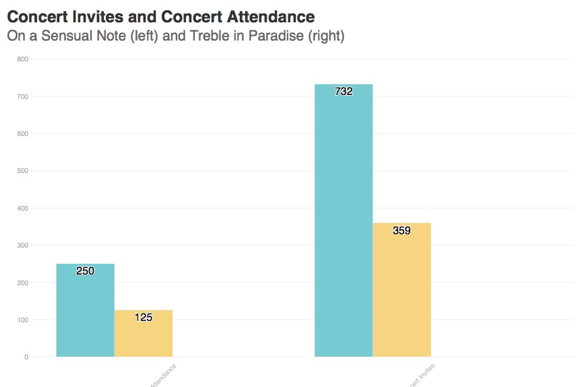
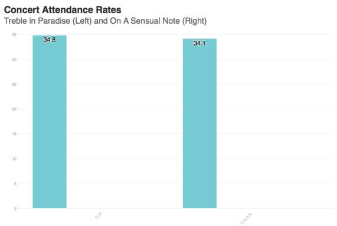
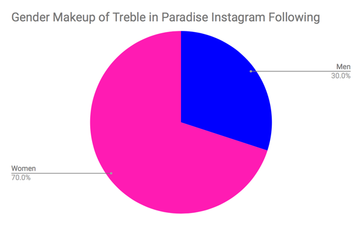
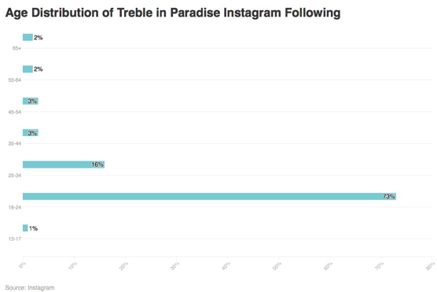
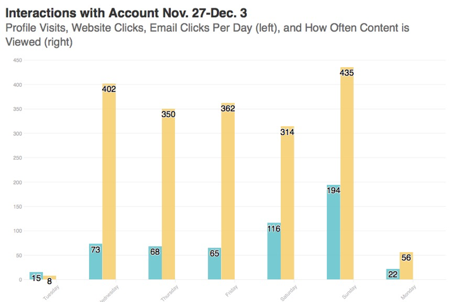

Treble in Paradise is American University’s oldest all-female a cappella group. Established in 2004, Treble in Paradise is currently comprised of fifteen girls who perform wearing their signature pink high heels. The group has a substantial following among American University students as well as the larger D.C. community. 

“At AU in general, it’s hard to get people excited about activities like sports and music,” said music director Maegan Weinhold. “The people in our audience, it’s always peoples best friends or a frat that is close to the girls.”

[Treble in Paradise](https://trebleinparadise.wixsite.com/treble) has performed at baseball games for the Washington Nationals, three consecutive National Christmas Tree Lightings as well as the nationally televised National Cherry Blossom Festival. Despite the group’s ever-growing follower pool, there seems to be a disconnect between Treble in Paradise’s social media and their concert attendance rate. “In general it has always been people who swim in our circle - relatives, friends, potential auditionees, members from other a cappella groups. But this is not effective,” Weinhold said.

The male counterpart to Treble is On a Sensual Note (OASN), AU’s only all-male a cappella group. While the members of their respective fan bases differ, their concert attendance rates are strikingly similar. 

   
					

OASN invited 732 people to their winter concert through their Facebook event page for the November 30th event. Of those 732, there were approximately 250 people in the audience. Treble invited 359 people through their Facebook event, and approximately 125 of them showed up to the Kay Spiritual Life Center for the gig on Dec 1. Both groups had roughly a 34 percent attendance rate for their concerts - Treble’s 34.8 percent was slightly higher than OASN’s 34.1 percent. 

Treble’s following on social media platforms like Facebook and Instagram has shown popularity among their targeted demographic: college students. The vast majority of Treble’s Instagram followers are women between the ages of 18-24 based in Washington, D.C. 

   

Treble’s Public Relations Chair and AU sophomore, Josee Molavi, is working to make a change in the group’s following pool. Molavi pointed out that social media is constantly changing, and Instagram in particular can now be used as the primary marketing tool for university clubs. 

The growing popularity of Instagram “Stories” has also become a tool of which Molavi says she is trying to take full advantage. She can post pictures, videos and links to Treble’s YouTube on their Instagram Story and then track the number of “impressions” the post has made throughout the day. Instagram allows users like Treble, who have business profiles, to track the number of profile visits, link clicks and emails sent through the app.
 

According to Molavi, follower count is more about quality than quantity. She says the crucial step in gaining a more engaged following was actually unfollowing some accounts. 

She said, “Our following was never significantly engaged in the past. In terms of us following people back who come to our gigs, that was kind of outdated. I unfollowed a lot of people, and then followed a lot more people that were actually engaging in our content, which makes for a better community of people to share our content with.” 

It seems as though these changes have yet to manifest in a larger turnout at concerts. Weinhold is aware of the disconnect and chalks it up to the groups differing fan bases and priorities. 

She said, “I’ve noticed that On a Sensual Note’s campus fanbase is larger, but they have no well-known presence in the larger DC area, and their social media following is same. Our two groups are the same on all fronts, but we have a greater DC presence and they have a greater campus presence.”

This problem is not a uniquely AU one, according to Joy Owings, a member of the co-ed [Belmont University Beltones](http://thebeltones.squarespace.com). She said that the Beltones sometimes have difficulty drawing a crowd, but that she thinks the group’s prominence in Nashville, often nicknamed “Music City”, has a lot to do with their exposure and ability to reach a wider fanbase. 

When asked about the Beltones’ following she said, “It grew when we were in ICCAs two years ago, significantly dropped last year because all we did was record for an album. I think the Beltones has a higher concert attendance just because we’re in Nashville and music is everywhere. The music environment just isn’t the same in D.C.” 

The race to gain more followers never ends for collegiate a cappella groups. Weinhold spoke the Treble in Paradise’s growing success and how that has translated into the group’s growing popularity and following. 

“The group became ‘good’ when we started to get cool gigs like singing at Nats games, Caps games and auditioning for The Sing Off,” she said, “From those gigs, those tangible accomplishments gave us something to post about that set us apart and showed our followers our credibility.” 

Former OASN President Peter Close said, “Overall, we’ve seen a decrease in the average attendance of our concerts. From what I’ve been told, all the groups on campus had their peak around the time the first Pitch Perfect movie came out.” He also said that much of the group’s publicity comes from individual members rather than the official OASN accounts. 

Perhaps group member engagement is the key to audience engagement, both on and offline. 

